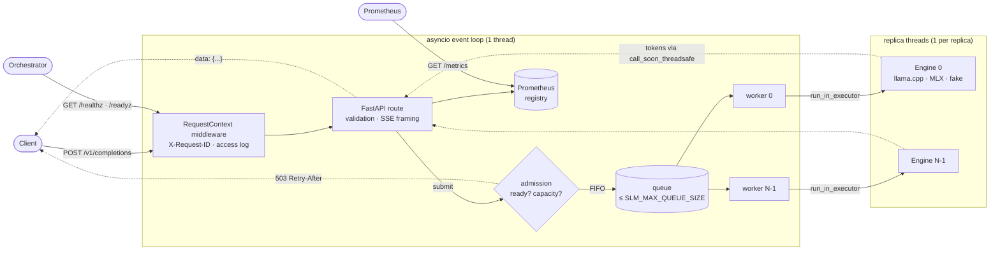

# slm-runtime

A small inference server for local small language models: an OpenAI-compatible streaming API
over llama.cpp (GGUF) and MLX backends, with explicit admission control, deadlines, cancellation
and Prometheus metrics.

[](https://github.com/ragnarlothbrok53/slm-inference-engine/actions/workflows/ci.yml)

## Why this exists

Loading a small model and generating text takes a few lines. Serving it to concurrent clients is
where things break:

- **Model objects aren't safe for concurrent use**, and inference calls block, so naive
  `async` handlers freeze the event loop. The prototype this grew from had that bug: one
  generation stalled every other request, health checks included.
- **Abandoned work keeps running.** A client that disconnects or times out still holds the
  model until `max_tokens`.
- **Overload shows up as latency.** Without a bounded queue, every extra request makes everyone
  slower, until clients time out and retry.
- **You can't tell why it's slow.** Was it time in the queue, prompt prefill, or decode speed?

slm-runtime is the serving layer that deals with these: about 1,100 lines of Python, tested
independently of any model, and benchmarked on real hardware with reproducible scripts. It is
**not** a replacement for vLLM, TGI or `llama-server`: it doesn't batch sequences (see
[Design tradeoffs](#design-tradeoffs)).

## Key features

- **OpenAI-compatible** `POST /v1/completions`, streaming (SSE) and non-streaming, with
  `max_tokens`, `temperature`, `top_p`, `stop`, `seed` and `usage`; plus `GET /v1/models`.
- **Pluggable backends** behind one small interface: llama.cpp (GGUF, CPU wheels for Linux,
  macOS and Windows), MLX (Apple Silicon), and a deterministic `fake` engine for tests and
  serving-overhead benchmarks. Backends are optional extras, imported lazily.
- **Scheduler**: inference runs on a dedicated thread per model replica, never on the event
  loop. A bounded FIFO queue fails fast with `503 + Retry-After`.
- **Deadlines and cancellation**: one per-request timeout (queue + generation). Timeouts and
  client disconnects stop generation within about one token.
- **Liveness vs. readiness**: the model loads in the background. `/healthz` answers at once;
  `/readyz` turns 200 when weights are loaded, or reports the load error.
- **Observability**: Prometheus metrics that separate queue wait, TTFT and decode speed;
  structured (JSON) logs with `X-Request-ID` propagation.
- **Evidence**: 42 tests (failure paths, a real-socket disconnect, an opt-in real-model test),
  strict mypy, CI, and a benchmark harness whose committed results are in
  [`benchmarks/results/`](benchmarks/results/README.md).

## Architecture



- **Request path.** The route validates, then `Scheduler.submit()` either rejects (`503`, before
  any response bytes are sent) or enqueues a job with a deadline. A free worker hands the job to
  its replica's thread, which runs the blocking engine loop and posts each token back to the
  event loop. The route streams tokens as SSE, or joins them into one JSON response.
- **Interfaces.** `Engine` (`load`, `count_tokens`, `generate → Iterator[Chunk]`, `close`) is
  the only thing a backend implements. It is synchronous by design; all concurrency lives in
  `scheduler.py`.
- **Failure boundaries.** Errors stay inside one request: validation `400`, overload `503`,
  deadline `504`, engine exception `500`, or an in-band SSE error once streaming has started. A
  failed model load leaves the process alive with `/readyz` reporting it. A native crash inside
  llama.cpp takes down the process (see [tradeoffs](#design-tradeoffs)).
- **State.** All in memory: weights (one copy per replica), the queue, metrics. Nothing persists.
- **External dependencies.** A model file on local disk. No network calls at runtime.

Details, including the sequence diagram, the thread model and the cancellation semantics:
[docs/architecture.md](docs/architecture.md).

## Technical design

The decisions that shape the system. Each is argued in full, with alternatives, in
[docs/design-decisions.md](docs/design-decisions.md).

| Decision | Why |
|---|---|
| Engines are synchronous; one worker and one OS thread per replica | Model objects aren't safe for concurrent use. An explicit queue can be bounded, observed and cancelled; a lock can't. |
| Bounded queue, fail fast with `503` | Keeps latency for accepted work bounded and gives callers a retryable signal instead of a late timeout. |
| Admission before the response starts | Overload is a real status code even for `stream: true`. |
| One deadline per request, enforced by the consumer | A stuck engine can't hold a client past it; the replica thread stops cooperatively between tokens. |
| Readiness = model loaded (not "has spare capacity") | Flipping readiness under load pushes traffic to other pods and cascades. Overload is signalled per request and in metrics. |
| Threads, not processes, per replica | `ctypes` releases the GIL during llama.cpp compute. Fault isolation is left to the container supervisor. |
| Prometheus, no tracing yet | Single process, no downstream calls: a trace would duplicate the histograms. The request ID propagation is ready for it. |

## Performance / Evaluation

All numbers below were **measured**: 3 interleaved runs per scenario, a fresh server per run,
commit `b848fa5`, on a Windows laptop (Intel Core Ultra 7 165U, 14 threads, 32 GB, CPU only)
running normal background software. Values are medians, with [min–max] across runs. Full tables,
raw per-request CSVs and environment metadata are in
[`benchmarks/results/`](benchmarks/results/README.md); methodology and caveats are in
[docs/benchmarking.md](docs/benchmarking.md). The model is **Qwen2.5-0.5B-Instruct Q4_K_M**
(469 MB GGUF).

**1. The scheduler behaves as queueing theory predicts** (`queueing`: fake engine with a known
360 ms service time, 1 replica):

| concurrency | throughput (req/s) | p50 latency (ms) | p50 TTFT (ms) | p50 inter-token (ms) |
|---|---|---|---|---|
| 1 | 2.56 | 388 | 55 | 10.6 |
| 2 | 2.59 | 770 | 433 | 10.7 |
| 4 | 2.58 | 1,536 | 1,200 | 10.7 |
| 8 | 2.58 | 3,065 | 2,730 | 10.7 |

Throughput stays flat, latency grows as C × ~384 ms, and the extra wait shows up entirely as TTFT
(queueing), not as slower streaming. Run-to-run spread is under 1%. Compared with the ideal
(2.78 req/s, 360 ms), the serving path adds **~28 ms per request**, about 0.7 ms per streamed
token.

**2. The serving layer isn't the bottleneck** (`overhead`: zero-latency fake engine). The stack
delivered **2.6k–3.8k streamed tokens/s** (median by concurrency level). A 64-token request
completes in a p50 of **22.9 ms** at concurrency 1. The CPU model below decodes ~25–30 tok/s per
stream, so the Python serving path is around 1% of the per-token budget. (Client and server shared
the CPU, so this is a lower bound.)

**3. Prompt prefill and the KV prefix cache dominate TTFT** (~1.2k-token prompt, 16 output tokens):

| | p50 TTFT | p50 latency |
|---|---|---|
| unique prompt each request (cold prefill) | **10,734 ms** [9,865–10,853] | 11,093 ms |
| identical prompt (llama.cpp reuses the KV cache) | **57 ms** [39–67] | 761 ms |

On this CPU, prefill runs at ~115 prompt tokens/s. Reusing the cached prefix cuts TTFT by about
190×. That's why prefix-aware routing is on the [10x list](#design-tradeoffs). It also explains why
the benchmark harness gives every request a unique prefix by default: my first version repeated
one prompt and reported cache hits as "TTFT".

**4. Real model: 1 replica × 8 threads vs. 2 replicas × 4 threads** (128 output tokens):

| concurrency | config | aggregate tok/s | p50 TTFT (ms) | p50 latency (ms) | per-request decode tok/s | peak RSS |
|---|---|---|---|---|---|---|
| 1 | 1×8 | 19.7 [13.7–24.2] | 576 | 6,044 | 24.2 | 602 MB |
| 1 | 2×4 | 24.7 [23.8–28.0] | 686 | 4,860 | 29.5 | 1,084 MB |
| 2 | 1×8 | 25.9 [19.8–27.0] | **5,276** | 9,515 | 30.6 | 603 MB |
| 2 | 2×4 | 33.0 [17.6–46.7] | **917** | 7,706 | 18.9 | 1,092 MB |
| 4 | 1×8 | 26.0 [22.4–37.7] | 13,108 | 17,200 | 31.1 | 604 MB |
| 4 | 2×4 | 31.3 [20.0–44.5] | 8,814 | 15,838 | 17.9 | 1,096 MB |

What this does and doesn't show:
- **Clear:** with 2 replicas, a second concurrent request starts right away instead of queueing.
  p50 TTFT at concurrency 2 drops from 5.3 s to 0.9 s. The cost is **1.8× the memory**, and each
  stream decodes slower (18.9 vs. 30.6 tok/s) because the replicas compete for the same cores and
  memory bandwidth.
- **Not established:** whether 2 replicas raise *aggregate* throughput. The medians are higher
  (33 vs. 26 tok/s at concurrency 2), but the run-to-run ranges overlap heavily on this laptop,
  which is power- and thermal-limited and shares its CPU with other software. I'm not claiming a
  throughput gain.
- **Also visible:** 4 threads per replica decoded as fast as 8 at concurrency 1 (median 29.5 vs.
  24.2 tok/s). More threads didn't make decode faster on this CPU; I haven't isolated why
  (memory bandwidth and the hybrid core layout are both plausible).
- With one replica, throughput is flat and latency grows linearly with concurrency, exactly as in
  scenario 1. Requests queue; nothing is batched.

Not measured: GPU, Linux, open-loop arrival patterns, other model sizes.

## Failure handling

| Situation | Response | Mechanism |
|---|---|---|
| Invalid request (bad params, `max_tokens` over limit, prompt too long) | `400 invalid_request_error` | pydantic + configured limits, before the scheduler |
| Model still loading / failed to load | `503 service_unavailable` | `/readyz` shows `loading` or `failed` + error |
| Queue full | `503 overloaded` + `Retry-After: 1` | `replicas + SLM_MAX_QUEUE_SIZE` requests in the system at most |
| Deadline exceeded (queued or generating) | `504 timeout` | `asyncio.timeout_at`; queued jobs are dropped unrun, running ones stop at the next token |
| Client disconnects mid-stream | generation cancelled | SSE generator `finally` → cancel flag → replica stops; counted as `outcome="cancelled"` |
| Exception inside the engine | `500 engine_error`, or an in-band `data: {"error": …}` if streaming already started | the replica thread reports the error as an event and keeps serving |
| SIGTERM | in-flight requests get 10 s; anything still queued gets `503`, running generation is cancelled, engines are closed | uvicorn graceful shutdown + lifespan |

There are no automatic retries inside the server: generation isn't idempotent under sampling, and
retry policy belongs to the caller, who gets `Retry-After` on `503`.

## Observability

**Metrics** (`GET /metrics`, Prometheus format):

| Metric | Type | Answers |
|---|---|---|
| `slm_queue_depth`, `slm_inflight_requests`, `slm_replicas` | gauge | Is it saturated? |
| `slm_rejected_total{reason}` | counter | How much load is being shed? |
| `slm_queue_wait_seconds` | histogram | Is latency coming from queueing… |
| `slm_time_to_first_token_seconds` | histogram | …or from prefill… |
| `slm_decode_tokens_per_second` | histogram | …or from slow decode? |
| `slm_request_duration_seconds` | histogram | End-to-end latency of successful requests |
| `slm_requests_total{outcome}` | counter | ok / timeout / cancelled / engine_error / shutdown |
| `slm_prompt_tokens_total`, `slm_generated_tokens_total` | counter | Work done |

**Logs**: one access line per request and one line per generation, sharing the request ID
(taken from `X-Request-ID` or generated, and echoed in the response). With `SLM_LOG_JSON=true`
each line is a JSON object. An example (text mode) from a real run:

```
13:08:02.169 INFO    generation finished {'request_id': '07482c1670ba46ae', 'finish_reason': 'stop', 'prompt_tokens': 26, 'completion_tokens': 14, 'queue_wait_ms': 0.0, 'ttft_ms': 172.0, 'duration_ms': 422.0}
13:08:02.171 INFO    POST /v1/completions 200 {'request_id': '07482c1670ba46ae', 'method': 'POST', 'path': '/v1/completions', 'status': 200, 'duration_ms': 431.4}
```

**Probes**: `GET /healthz` (process is alive), `GET /readyz` (weights loaded; `503` with
`loading` or `failed` + error otherwise). The Docker image's `HEALTHCHECK` uses `/readyz`.

## Quick start

Requires Python 3.11+ and [uv](https://docs.astral.sh/uv/).

```bash
git clone https://github.com/ragnarlothbrok53/slm-inference-engine.git
cd slm-inference-engine
uv sync --extra llama          # prebuilt CPU wheel for llama.cpp; no compiler needed

mkdir -p models
curl -L -o models/qwen2.5-0.5b-instruct-q4_k_m.gguf \
  https://huggingface.co/Qwen/Qwen2.5-0.5B-Instruct-GGUF/resolve/main/qwen2.5-0.5b-instruct-q4_k_m.gguf

uv run slm-runtime serve       # http://127.0.0.1:8000
```

No model? `SLM_ENGINE=fake uv run slm-runtime serve` serves deterministic fake tokens through
the same stack.

**Docker** (CPU, llama.cpp backend; the model is mounted, not baked in):

```bash
docker build -t slm-runtime .
docker run --rm -p 8000:8000 -v "$PWD/models:/models:ro" \
  -e SLM_MODEL_PATH=/models/qwen2.5-0.5b-instruct-q4_k_m.gguf slm-runtime
```

## Usage

```bash
# Non-streaming
curl -s localhost:8000/v1/completions -H 'content-type: application/json' -d '{
  "prompt": "<|im_start|>user\nName three prime numbers.<|im_end|>\n<|im_start|>assistant\n",
  "max_tokens": 30, "temperature": 0, "stop": ["<|im_end|>"]
}'
# {"id":"cmpl-…","object":"text_completion","created":…,"model":"qwen2.5-0.5b-instruct-q4_k_m.gguf",
#  "choices":[{"index":0,"text":"Three prime numbers are 2, 3, and 5.","finish_reason":"stop"}],
#  "usage":{"prompt_tokens":26,"completion_tokens":14,"total_tokens":40}}

# Streaming (SSE): one event per token, a final event with finish_reason + usage, then [DONE]
curl -sN localhost:8000/v1/completions -H 'content-type: application/json' \
  -d '{"prompt": "Hello", "max_tokens": 3, "stream": true}'
```

The official OpenAI Python SDK works against it as is (checked with `openai` 3.26.1, streaming
and non-streaming):

```python
from openai import OpenAI

client = OpenAI(base_url="http://127.0.0.1:8000/v1", api_key="unused")
for chunk in client.completions.create(model="any", prompt="Hello", max_tokens=32, stream=True):
    print(chunk.choices[0].text, end="", flush=True)
```

The server exposes the raw completions API, so chat templates are applied by the client.
[`examples/simple_chat.py`](examples/simple_chat.py) is a small streaming chat REPL that applies
ChatML (the Qwen2.5 template).

```bash
uv run slm-runtime info        # detected hardware + effective configuration
```

## Configuration

Environment variables (prefix `SLM_`), a `.env` file (see [`.env.example`](.env.example)), or
`serve` flags (`--model`, `--engine`, `--host`, `--port`, `--replicas`, `--n-threads`), which
take precedence. Full definitions, types and bounds: [`config.py`](src/slm_runtime/config.py).

| Variable | Default | Meaning |
|---|---|---|
| `SLM_ENGINE` | `llama_cpp` | `llama_cpp`, `mlx` or `fake` |
| `SLM_MODEL_PATH` | `models/qwen2.5-0.5b-instruct-q4_k_m.gguf` | GGUF file (llama.cpp) or model dir / HF id (MLX) |
| `SLM_N_CTX` | `4096` | Context window (llama.cpp) |
| `SLM_N_THREADS` | auto | CPU threads per replica, for decode and prefill |
| `SLM_N_GPU_LAYERS` | `0` | Layers to offload (needs a CUDA/Metal build of llama-cpp-python) |
| `SLM_REPLICAS` | `1` | Independent model copies, each with its own thread |
| `SLM_MAX_QUEUE_SIZE` | `32` | Requests that may wait for a replica before `503` |
| `SLM_REQUEST_TIMEOUT_S` | `120` | Deadline covering queue wait and generation |
| `SLM_MAX_TOKENS_LIMIT` | `1024` | Upper bound on a request's `max_tokens` |
| `SLM_MAX_PROMPT_CHARS` | `32000` | Upper bound on prompt length |
| `SLM_FAKE_TTFT_S`, `SLM_FAKE_TOKEN_LATENCY_S` | `0` | Simulated latency for the `fake` engine |
| `SLM_HOST`, `SLM_PORT` | `127.0.0.1`, `8000` | Bind address |
| `SLM_LOG_LEVEL`, `SLM_LOG_JSON` | `INFO`, `false` | Logging |

## Testing

```bash
uv sync                          # dev tools included; backends not required
uv run pytest                    # 42 tests, ~15 s; the real-model test runs if the GGUF is present
uv run ruff check . && uv run ruff format --check . && uv run mypy
```

What the tests pin down, in [`tests/`](tests/):

- **Scheduler** (`test_scheduler.py`): FIFO order; one request per replica; replicas run in
  parallel; queue-full rejection (including `max_queue_size=0`); a deadline while generating
  frees the replica; a deadline while queued skips the work entirely; cancellation stops backend
  work; an engine exception is isolated to one request; load failure; shutdown semantics; metrics.
- **HTTP contract** (`test_api.py`): response and SSE shapes, validation → `400`, overload →
  `503 + Retry-After` even for streaming, `504`, `500`, in-band stream errors, readiness during
  load and after a failed load, request IDs, `/metrics`. Includes regression tests for the
  prototype's bugs (blocked event loop, ignored `max_tokens`, unknown engine).
- **Integration** (`test_integration.py`): a real uvicorn server where the client drops the
  socket mid-stream and the replica is free again within 2 s; plus an end-to-end test against
  the real Qwen2.5-0.5B GGUF (greedy streaming output equals non-streaming output).

The tests were checked by mutation. Moving inference back onto the event loop fails 8 tests;
removing the cancellation check fails the deadline, cancellation and real-socket disconnect
tests.

CI ([`.github/workflows/ci.yml`](.github/workflows/ci.yml)) runs lint, format, strict mypy and
tests; the real-model integration test (with a cached model download); and a Docker build plus a
smoke test of the container.

## Benchmarking

```bash
uv run python benchmarks/run_benchmarks.py --list
uv run python benchmarks/run_benchmarks.py overhead queueing       # no model needed, ~3 min
uv run python benchmarks/run_benchmarks.py --runs 3                # everything, ~45 min on a laptop

# Against any running server (this one or another OpenAI-compatible server):
uv run python benchmarks/loadgen.py --url http://127.0.0.1:8000 --concurrency 1 2 4 --requests 20
```

Each run starts a fresh server, samples its memory and CPU, and writes JSON/CSV with the commit,
hardware and configuration. The methodology and caveats are in
[docs/benchmarking.md](docs/benchmarking.md).

## Design tradeoffs

**Why a custom serving layer instead of `llama-server` / vLLM?** Those are faster: they batch
concurrent sequences, which this project doesn't. What this project offers instead is serving
*policy* (admission, deadlines, cancellation, readiness, metrics) as small, explicit, tested
Python, plus pluggable backends. If raw throughput is the goal, use a batching server.

**Why FastAPI + threads instead of a process pool?** llama.cpp releases the GIL, so threads give
real parallelism. The Python serving path costs well under a millisecond per token (measured), far
below decode time on CPU. A process pool would add fault isolation at the cost of IPC and
complexity; one replica per container gets the same isolation more simply.

**Where it breaks down:**
- **No batching.** One replica's throughput is flat as concurrency grows, so latency grows
  linearly with load. On GPUs this would waste most of the hardware.
- **Replicas are a blunt instrument.** Each one holds a full copy of the weights (1.8× memory
  for 2), and they compete for the same cores and bandwidth. Measured, they cut TTFT under load
  sharply, but I couldn't show an aggregate-throughput gain beyond run-to-run noise (see
  Performance).
- **A native crash takes down every replica.** Threads share the process.
- **Single-process event loop.** It handled ~4,000 tokens/s of SSE in the `overhead` benchmark:
  irrelevant at CPU decode speeds, but a bottleneck for a fast GPU serving many streams.
- **No prefix-cache management.** llama.cpp reuses the KV cache only when consecutive requests on
  the same replica share a prefix; nothing routes requests to exploit that.

**Current limitations:** completions API only (no chat endpoint, no tool calling); one model per
process; no auth or per-tenant rate limiting; `usage.completion_tokens` counts streamed chunks,
which llama-cpp-python can merge for multi-byte UTF-8 (exact for English, possibly low for
non-Latin scripts); the MLX backend isn't exercised in CI.

**At 10x scale I would change:**
1. Move to a batching engine (vLLM/SGLang on GPU, `llama-server --parallel` on CPU) and keep this
   layer's API, admission and metrics as a thin gateway in front of it, or implement continuous
   batching on llama.cpp's low-level batch API.
2. One replica per container; route with least-outstanding-requests using `slm_queue_depth`
   rather than round-robin; autoscale on queue wait / TTFT, not CPU.
3. Prefix-aware routing (send requests that share a system prompt to the same replica) to turn
   llama.cpp's KV reuse into a deliberate feature; the `llama-long-prompt-cached` benchmark shows
   how large the effect is.
4. Per-tenant quotas and priority queues instead of one FIFO; open-loop load tests to measure
   behaviour past saturation; OpenTelemetry tracing once there are multiple hops.

## Roadmap

- `/v1/chat/completions` using the chat template embedded in GGUF metadata
- Continuous batching on llama.cpp's low-level API, benchmarked against `llama-server --parallel`
- Open-loop (Poisson arrival) mode in the load generator
- Prefix-affinity routing across replicas
- CUDA/Metal build variants of the Docker image

## Project structure

```
src/slm_runtime/    app.py · scheduler.py · engines/ · metrics.py · schemas.py · config.py · logs.py · hardware.py · cli.py
tests/              scheduler, HTTP contract, integration (real socket, real model)
benchmarks/         loadgen.py · run_benchmarks.py · results/
docs/               architecture.md · design-decisions.md · benchmarking.md
examples/           simple_chat.py
```

## License

MIT, see [LICENSE](LICENSE).
