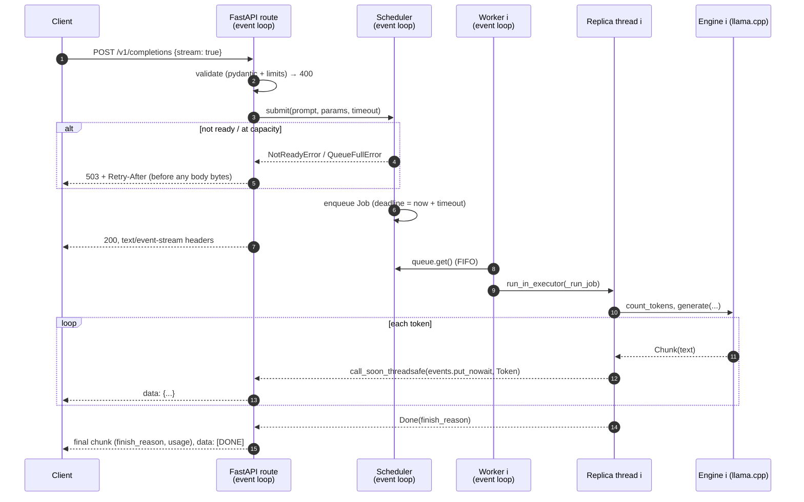

# Architecture

A single-process HTTP server that owns one or more in-memory model replicas and multiplexes
concurrent requests onto them.

```
src/slm_runtime/
├── app.py          FastAPI app factory: routes, error mapping, request-ID/access-log middleware, lifespan
├── scheduler.py    admission control, FIFO queue, replica workers, thread↔event-loop bridge, deadlines
├── engines/
│   ├── base.py     Engine ABC + GenerationParams / Chunk
│   ├── llama_cpp.py  GGUF via llama-cpp-python
│   ├── mlx.py      Apple Silicon via mlx-lm
│   ├── fake.py     deterministic, configurable latency: tests and serving-overhead benchmarks
│   └── __init__.py create_engine(): lazy backend imports
├── schemas.py      OpenAI-compatible request/response models
├── metrics.py      Prometheus metrics (per-app registry)
├── config.py       pydantic-settings (SLM_* env vars / .env)
├── logs.py         loguru setup (text or JSON), stdlib logging interception
├── hardware.py     host description for `info` and benchmark metadata
└── cli.py          `slm-runtime serve | info`
```

## Request lifecycle (streaming)



Non-streaming requests follow the same path. The route collects the tokens and returns one JSON
body.

## Concurrency model

| Context | Runs | Never does |
|---|---|---|
| Event loop (1 thread) | HTTP parsing, validation, admission, queue, SSE writes, metrics | model compute, blocking I/O |
| Replica thread *i* (1 per replica, `ThreadPoolExecutor(max_workers=1)`) | `engine.load`, `count_tokens`, `generate`, `close` for replica *i* only | touch asyncio objects directly |

- **One request per replica at a time.** llama.cpp contexts and MLX models are stateful and not
  safe for concurrent calls. Pinning each replica to one thread also keeps all calls for a model
  on the same OS thread, which some backends assume.
- **Hand-off.** The replica thread pushes events into the request's `asyncio.Queue` through
  `loop.call_soon_threadsafe`. That is the only cross-thread channel. No locks are needed because
  scheduler state (`_pending`, `_running`) is only mutated on the event loop.
- **The GIL.** llama.cpp releases the GIL during its C++ compute, so the event loop keeps serving
  while a replica decodes. The `overhead` benchmark shows the Python serving path costs well under
  1 ms per token, far below a CPU model's ~15–25 ms per token.

## Admission control and backpressure

Capacity is `replicas + SLM_MAX_QUEUE_SIZE` requests in the system. Request number capacity + 1
gets an immediate `503` with `Retry-After: 1`. Rejecting at admission, rather than queueing without
limit, means:

- latency for accepted requests stays bounded at about `(queue + 1) × service time`;
- a load balancer or client can retry elsewhere straight away instead of timing out later;
- memory doesn't grow with offered load.

Because admission happens *before* the streaming response starts, overload is a real HTTP status
code even for `stream: true`.

## Deadlines and cancellation

Each request carries one deadline (`SLM_REQUEST_TIMEOUT_S`) covering queue wait and generation.
It is enforced on the consumer side with `asyncio.timeout_at`, so a hung engine can't hold a
client past it.

When a request ends early (timeout, client disconnect, shutdown), the consumer sets the job's
`threading.Event`:

- **Still queued:** the worker drops the job when it dequeues it. The model never sees it.
- **Generating:** the replica thread checks the flag between tokens, stops, and closes the engine
  iterator (llama.cpp stops decoding). The replica is free again within about one token.

Without this, a disconnected client would keep a replica busy until `max_tokens`. Tests cover
each case, including a real socket disconnect against a live uvicorn server.

## Failure boundaries

| Failure | Blast radius | Behaviour |
|---|---|---|
| Invalid request | that request | `400 invalid_request_error`, never reaches the scheduler |
| Model file missing / load error | whole server, reported | process stays up; `/healthz` 200, `/readyz` 503 `{"status":"failed"}`; completions 503 |
| Overload | new requests | `503 overloaded` + `Retry-After` |
| Exception inside the engine | that request | `500 engine_error` (or an in-band SSE error event after headers); the replica keeps serving |
| Deadline exceeded | that request | `504 timeout`; backend work cancelled |
| Client disconnect | that request | generation cancelled, `slm_requests_total{outcome="cancelled"}` |
| Native crash in llama.cpp (segfault/OOM) | whole process | not recoverable in-process; relies on the supervisor (Docker/k8s) restart. See design-decisions. |

## State

All state is in memory and per process: model weights (one copy per replica), the request queue,
and metrics. Nothing is persisted, and restarting drops queued requests. A KV cache exists only
inside each llama.cpp context and is reused across requests only to the extent llama-cpp-python's
own prefix matching allows.

## Lifecycle

1. `create_app` builds engines (lazily importing the backend), metrics and scheduler.
2. On startup, the lifespan starts `scheduler.start()` **in the background**. The server accepts
   connections at once: `/healthz` = 200, `/readyz` = 503 `loading`.
3. All replicas load in parallel on their own threads. On success, workers start and `/readyz`
   returns 200. On failure, `/readyz` reports the error.
4. On SIGTERM, uvicorn stops accepting connections and gives in-flight requests up to 10 s
   (`timeout_graceful_shutdown`) to finish. Then the lifespan shutdown runs: the scheduler stops
   admitting, fails anything still queued, cancels in-flight generation, and calls
   `engine.close()` on each replica thread.
